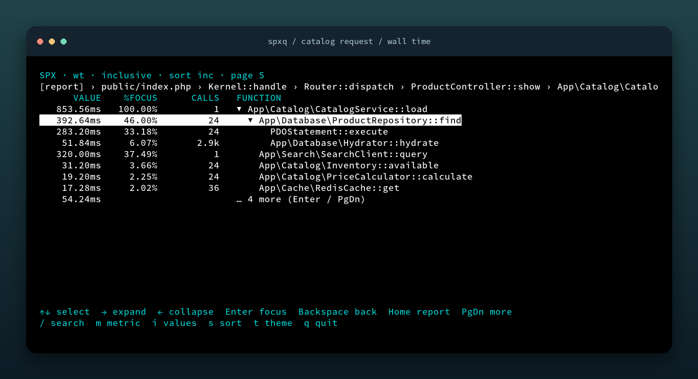
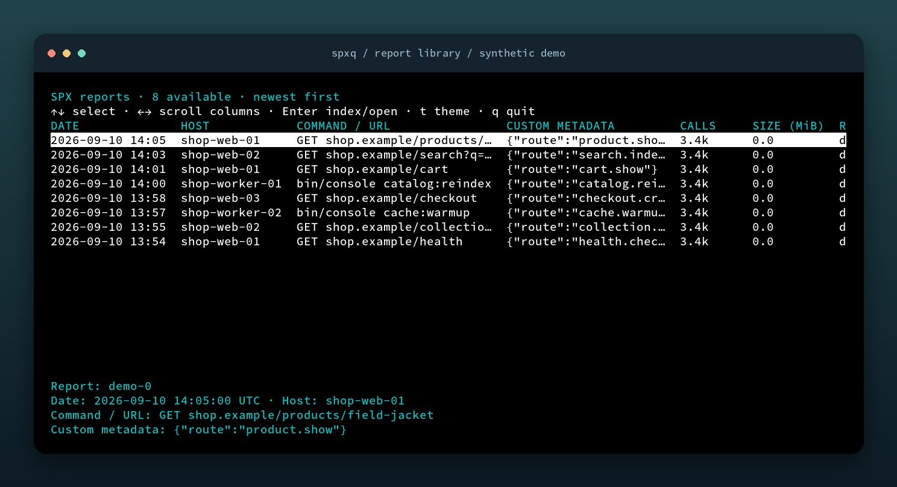
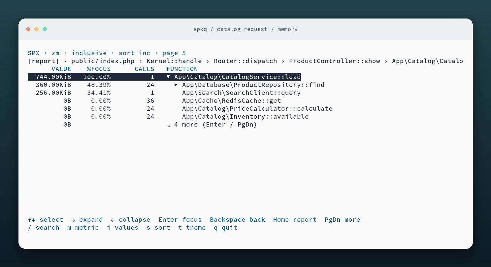

<p align="center">
  
</p>
<h1 align="center">spxq</h1>
<p align="center"><strong>Big PHP profiles. Small, searchable call trees.</strong></p>
<p align="center">
  <a href="https://github.com/zviryatko/spxq/actions/workflows/build.yml"></a>
  <a href="https://github.com/zviryatko/spxq/releases"></a>
  <a href="LICENSE"></a>
</p>

**spxq** is a terminal explorer for [PHP-SPX](https://github.com/NoiseByNorthwest/php-spx) reports. Stream a compressed profile into SQLite once, then expand, focus, search, and sort its aggregated call tree. No browser, account, telemetry, or uploads. Your source reports stay untouched.



*Captured from the real terminal UI using the included synthetic demo. Window frames are decorative.*

## Why spxq?

- **Import large reports without loading every event into memory.** Store unique call paths, not raw events.
- **Follow the expensive branch.** Lazy expansion, sibling pagination, hidden-sibling totals, and focus/back navigation.
- **Keep the data that matters.** All recorded metrics, inclusive/exclusive values, signed memory changes, and fractional deltas.
- **Query from a shell.** `tree`, `flat`, `search`, and `callers` alongside the interactive viewer.
- **Choose your terminal theme.** Dark or light, with an instant `t` toggle.

## Install

Download an archive from [Releases](https://github.com/zviryatko/spxq/releases/latest):

| Platform | Archive suffix |
| --- | --- |
| Linux x86-64 | `linux_amd64.tar.gz` |
| Linux ARM64 | `linux_arm64.tar.gz` |
| macOS Intel | `darwin_amd64.tar.gz` |
| macOS Apple Silicon | `darwin_arm64.tar.gz` |

Extract it and put `spxq` on your `PATH`. Each release includes `checksums.txt` with SHA-256 checksums. Linux binaries are statically linked with musl; macOS binaries use system libraries and are not signed or notarized. ARM means 64-bit ARM; 32-bit x86/ARM are not release targets.

Build from source with **Go 1.23+ and a C compiler** (SQLite uses CGO):

```sh
git clone https://github.com/zviryatko/spxq.git
cd spxq
go build -o spxq .
```

Or install with Go:

```sh
go install github.com/zviryatko/spxq@latest
```

## Try it

An entirely synthetic report is included in the repository:

```sh
./spxq import examples/demo.json -o demo.db
./spxq view demo.db
```

For your own reports:

```sh
# Pick a report; the first open creates a local index.
spxq view --dir /path/to/spx/reports

# Open a report directly, or reopen an existing database.
spxq view /path/to/report.json
spxq view report.db --theme light
```

The picker shows date, host, command or URL, custom metadata, calls, size, and report key. Use **←/→** to scroll wide columns. Selected-report details appear below the list; dates use the local timezone.

<details>
<summary>See the report picker</summary>



</details>

### Report discovery and cache

Report discovery uses, in order: `--dir`, the `SPXQ_REPORT_DIR` environment variable, the plain-text `spxq/report-dir` file inside your user config directory, or the current directory. On Linux the config file is normally `~/.config/spxq/report-dir`; on macOS it is `~/Library/Application Support/spxq/report-dir`.

```sh
export SPXQ_REPORT_DIR=/path/to/spx/reports
spxq view
spxq reports --limit 20
spxq view REPORT_KEY
```

Automatic indexes live in your user cache directory under `spxq`: normally `~/.cache/spxq` on Linux and `~/Library/Caches/spxq` on macOS. Use `--cache PATH` to override it. Cache keys include source paths, sizes, modification times, schema, and incomplete-trace policy. Delete cached databases to reclaim space.

Import is a sequential scan and can take time and disk space. **Ctrl-C cancels safely** without publishing a partial database. Existing explicit import destinations are never overwritten.

## Controls

| Key | Action |
| --- | --- |
| ↑ / ↓ | Select a row |
| → / ← | Expand / collapse, or move to parent |
| Enter | Focus a node; load another page on a “more” row |
| Backspace | Return to previous focus |
| Home | Return to report root |
| PgDn | Load more children; otherwise move down a screen |
| PgUp | Move up a screen |
| `/`, Enter | Search function names |
| Esc | Cancel search / return to tree |
| `m` | Cycle recorded metrics |
| `i` | Switch inclusive/exclusive values |
| `s` | Sort by inclusive, exclusive, or calls |
| `t` | Toggle light/dark theme; works in the picker too |
| `q` / Ctrl-C | Quit |

Ancestors in breadcrumbs use `Class::method` or the last two path components; the focused item keeps its full name. Percentages use the focused node's inclusive total. Search is case-sensitive, supports SQLite glob patterns, and returns up to 1,000 matching call-tree nodes. Plain text becomes a substring search.

<details>
<summary>See the light theme</summary>



</details>

## Shell queries

```sh
spxq import report.json -o report.db
spxq import report.json report.txt.zst -o report.db

spxq tree report.db --depth 3 --limit 20 --metric wt
spxq tree report.db --root 42 --depth 2
spxq flat report.db --metric wt --sort exc --limit 50
spxq search report.db '*Doctrine*'
spxq callers report.db '*PDOStatement::execute*'
spxq --version
```

Flags work before or after positional arguments. `tree` and `search` IDs identify call-tree nodes usable with `--root`; `flat` and `callers` IDs identify functions. Tree sibling limits retain the total value of hidden children.

## How the index works

```text
SPX JSON + .txt.gz / .txt.zst / .txt
                 │
         one streaming pass
                 │
      stack + bounded aggregation cache
                 │
     SQLite: functions + aggregated paths
                 │
        paginated terminal queries
```

A node is a `(parent node, function ID)` pair. Inclusive values are end minus start; exclusive values subtract direct children. Flat inclusive totals count only the outermost active invocation of each function, avoiding recursive double counting. Caller queries sum matching call edges, so overlapping recursive edges can contribute more than once.

The importer retains all recorded metrics as 64-bit floating-point values. Time metrics are microseconds, memory metrics are bytes, and counters remain counts. Negative and fractional metric values are supported. Schema 2 uses SQLite REAL columns; schema 1 integer databases remain readable.

Memory use depends on the active stack, a 100,000-path lookup cache, a 200,000-event aggregation batch, and SQLite's page cache. Database size depends on unique paths and metric count. The viewer loads expanded pages; flat/search queries scan the aggregate index. Individual invocation/timeline views are not included.

### Format support and validation

- Legacy space-separated enter/exit events and SPX v0.5 pipe-separated delta/back-reference events.
- gzip, Zstandard, and uncompressed text bodies; function locations where available.
- Malformed or non-finite numbers, invalid back-references, mismatched exits, missing functions/sections, and corrupt compression fail the import.
- Unclosed frames fail unless `--allow-incomplete` explicitly closes them at the final event and marks the database. Metadata call-count discrepancies produce warnings.
- The synthetic `[report]` node has ID 1 and sums top-level calls. Gaps between separate top-level invocations are not assigned to a function, so totals may differ slightly from sidecar elapsed time.

The format implementation was checked against the upstream [SPX parser](https://github.com/NoiseByNorthwest/php-spx-mcp/blob/main/src/SpxReportParser.php) and [full reporter](https://github.com/NoiseByNorthwest/php-spx/blob/master/src/spx_reporter_full.c). This project is independent of PHP-SPX.

## Development

```sh
go test ./...
go vet ./...
```

Tests cover both event encodings, compression, recursion, repeated paths, negative/fractional metrics, pagination, cancellation, incomplete traces, and atomic publication. During development, a 96,521,187-call report imported successfully in approximately 84 seconds on one Linux machine; that is an observation, not a portable benchmark.

See [CONTRIBUTING.md](CONTRIBUTING.md) for development, screenshot generation, and release instructions. GitHub Actions builds and tests all four release targets; `v*` tags publish archives and checksums after every job passes.

## License

[MIT](LICENSE). Dependencies retain their own licenses; see [third-party notices](THIRD_PARTY_NOTICES.md).
